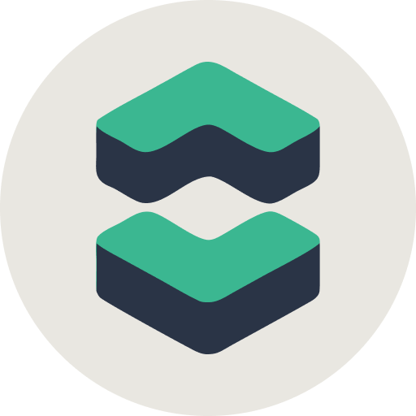

<div align="center">
  
  <h1>Claude Code Manager</h1>
  <p>A dark-themed desktop app to manage multiple <a href="https://claude.com/claude-code">Claude Code</a> sessions across your projects — from a single window.</p>
</div>

---

## What is it?

Claude Code Manager is a lightweight Linux desktop app (built with Tauri + Rust + Svelte 5) that lets you drive the official `claude` CLI from a graphical interface. Think of it as a project switcher and chat UI sitting on top of Claude Code — you register your codebases once, then chat with Claude in each of them without juggling terminals.

Under the hood, the app spawns real `claude` processes with `--output-format stream-json` and parses the event stream, so everything the CLI supports (tools, MCP servers, skills, hooks, session resume) works out of the box.

## Features

- **Multi-project sidebar** — register any number of local codebases and switch between them instantly.
- **Parallel sessions** — run Claude in several projects at the same time; each has its own running state.
- **Session resume** — sessions are persisted by Claude Code itself (`~/.claude/projects/*.jsonl`), so closing the app or restarting it never loses context. The next message automatically uses `--resume`.
- **CLI-style rendering** — tool calls (Read, Edit, Write, Bash, Grep, Glob, TodoWrite, Task, WebFetch…) are rendered with icons, collapsible details, real diff view for `Edit`, todo checklists, and syntax-highlighted code blocks.
- **Full Markdown** in assistant responses (GFM tables, code blocks with highlight.js, headings, lists, quotes, links).
- **Pause with added guidance** — mid-turn, freeze the entire Claude process tree with `SIGSTOP`, optionally type extra instructions, then resume (either continue as-is with `SIGCONT`, or abort the current turn and inject your new message into the same conversation via `--resume`).
- **Right panel** — collapsible panel showing configured MCP servers (live from `claude mcp list`), quick actions (open project folder, copy session id), and project metadata.
- **Remote access from your phone** — toggleable HTTP/WebSocket server that serves the same UI over your network. Combine with [Tailscale](https://tailscale.com) for secure access from anywhere without exposing ports.
- **Skip permissions by default** — runs Claude with `--dangerously-skip-permissions` so you never get blocked by prompts.
- **Native dark theme** built for long coding sessions.

## Screenshots

<!-- Add screenshots here -->

## Requirements

You only need two things to **run** the app — the packaged binaries already include everything else.

1. **Linux** with a modern desktop environment (Fedora, Ubuntu, Debian, Arch, openSUSE…). Most DEs already ship `webkit2gtk`; if not, install it (`webkit2gtk4.1` on Fedora, `libwebkit2gtk-4.1-0` on Debian/Ubuntu).
2. **[Claude Code CLI](https://docs.claude.com/en/docs/claude-code/quickstart)** installed and authenticated. The `claude` binary must be on your `PATH`.

> You do **not** need to install Rust, Node.js, Tauri, or any build tool. Those are only required if you want to build from source.

## Installation

### Fedora / RHEL / openSUSE (RPM)

Download the `.rpm` from the [latest release](https://github.com/fabian-laine/claude-code-manager/releases/latest), then:

```bash
sudo dnf install ./claude-code-manager-*.x86_64.rpm
```

### Debian / Ubuntu (DEB)

```bash
sudo apt install ./claude-code-manager_*_amd64.deb
```

### Any distro (AppImage)

```bash
chmod +x claude-code-manager_*_amd64.AppImage
./claude-code-manager_*_amd64.AppImage
```

### Arch Linux

No official package yet — build from source (see below) or use the AppImage.

## Build from source

Only needed if you want to hack on the code or build an unreleased version. Packaged releases already include the compiled binary.

**Prerequisites (one-time setup):**

- **Rust toolchain** (stable) — install via [rustup](https://rustup.rs):
  ```bash
  curl --proto '=https' --tlsv1.2 -sSf https://sh.rustup.rs | sh
  ```
- **Node.js 20+** and **pnpm** (`npm install -g pnpm`)
- **System libraries** for WebKitGTK and bundling:
  - Fedora: `sudo dnf install webkit2gtk4.1-devel openssl-devel curl wget file libappindicator-gtk3-devel librsvg2-devel patchelf rpm-build`
  - Debian/Ubuntu: `sudo apt install libwebkit2gtk-4.1-dev libappindicator3-dev librsvg2-dev libssl-dev patchelf file`
  - Arch: `sudo pacman -S webkit2gtk-4.1 libappindicator-gtk3 librsvg patchelf file`

> You don't need to install the Tauri CLI globally — it's already declared as a dev dependency and `pnpm install` will pull it in.

**Build:**

```bash
git clone https://github.com/fabian-laine/claude-code-manager.git
cd claude-code-manager
pnpm install
pnpm tauri build --bundles rpm deb appimage
```

Artifacts land in `src-tauri/target/release/bundle/`. First build takes ~5 minutes because it compiles Tauri + dependencies; subsequent builds are incremental.

**Run in dev mode:**

```bash
pnpm tauri dev
```

## Remote access (use from your phone)

Claude Code Manager can serve its own UI over HTTPS so you can drive Claude from a phone, tablet, or another computer while your main PC keeps running the actual sessions. The transport is end-to-end encrypted, token-protected, and works from anywhere on the internet via Tailscale without exposing any port to the public.

> **Note:** your PC must stay on and the app running — the laptop does all the work; the phone is just a remote UI.

### 1. One-time Tailscale setup on the PC

[Tailscale](https://tailscale.com) creates a free, private network between your devices. Nothing is published to the public internet.

```bash
# Fedora — use apt/pacman on other distros
sudo dnf install tailscale
sudo systemctl enable --now tailscaled
sudo tailscale up

# Allow cert generation without root so the app can manage certificates
sudo tailscale set --operator=$USER
```

Then enable HTTPS certificates in the Tailscale admin: [login.tailscale.com/admin/dns](https://login.tailscale.com/admin/dns) → **HTTPS Certificates** → Enable. This lets Tailscale issue real Let's Encrypt certs for your `*.ts.net` hostname.

### 2. Open Settings in the desktop app

Click **⚙ Settings** in the sidebar footer. The **Remote access** section shows a 5-step checklist that checks each prerequisite live:

1. ✓ Tailscale installed (auto-detected)
2. ✓ Cert generation allowed without sudo
3. ✓ HTTPS enabled in admin console
4. **Generate the TLS certificate** — click the button. The app runs `tailscale cert` and saves the files to its data directory.
5. **Start the server** — pick a port (default 17890) and click Start.

Once started, the URL section shows your Tailscale HTTPS address (e.g. `https://fedora.tailXXXX.ts.net:17890`) and the access token. **Copy both** — you'll paste them on your phone.

### 3. Install Tailscale on your phone

- **iPhone** — App Store → "Tailscale" → sign in with the same account.
- **Android** — Play Store → "Tailscale" → sign in with the same account.

Turn on the VPN toggle. Your phone is now on the same private network as your PC, even over cellular.

### 4. Open the URL in your mobile browser

Paste the `https://fedora.tailXXXX.ts.net:17890` URL in Safari (iOS) or Chrome (Android). You'll see the access token screen — paste the token, tap **Sign in**, and you're in.

### 5. (Optional) Add to home screen

Get an app-like icon on your phone:

- **iOS / Safari** — Share button → "Add to Home Screen".
- **Android / Chrome** — menu ⋮ → "Add to Home screen".

Tapping the icon opens Claude Code Manager in standalone mode, with its own icon and splash screen. You can now send messages to Claude from anywhere.

### Security notes

- The server binds to `0.0.0.0` but Tailscale ACLs and its VPN mean only devices on your tailnet can reach it. Every API call still requires a bearer token.
- You can **rotate the token** at any time from Settings — this invalidates all existing sessions on remote devices.
- All traffic between phone and PC is TLS 1.3 via Tailscale's own Let's Encrypt certificates.
- No port forwarding, no public DNS, no exposed service. If you pause Tailscale on either end, the URL becomes unreachable — by design.

### Troubleshooting

**Browser shows `ERR_SSL_PROTOCOL_ERROR`** — you typed `http://` on a `*.ts.net` domain. Browsers force HTTPS on Tailscale domains via HSTS preload. Make sure you enabled HTTPS in the app Settings and generated the cert before starting the server.

**"tailscale cert: access denied"** — you forgot `sudo tailscale set --operator=$USER`. Run that once, then click Generate again in Settings.

**"Connection refused" on mobile** — check Tailscale is connected on the phone (the app should show "Connected"). Also verify the desktop app is still running and the server is enabled in Settings.

## Troubleshooting

**The app crashes on launch with a Wayland protocol error.** This is a known webkit2gtk issue on recent Fedora/GNOME. The installed `.desktop` file already sets the workaround env vars, but if you launch the binary directly:

```bash
WEBKIT_DISABLE_DMABUF_RENDERER=1 WEBKIT_DISABLE_COMPOSITING_MODE=1 claude-code-manager
```

**"claude: command not found"** — install and authenticate [Claude Code](https://docs.claude.com/en/docs/claude-code/quickstart) first.

## Architecture

```
┌───────────────┐       ┌────────────────────────┐      ┌──────────────┐
│  Svelte 5 UI  │◄─────►│   Rust / Tauri backend │◄────►│  claude CLI  │
│  (SvelteKit)  │ events│  session manager       │stdio │  subprocess  │
└───────────────┘       │  SQLite (projects)     │      └──────────────┘
                        └────────────────────────┘             │
                                                               ▼
                                                ~/.claude/projects/*.jsonl
                                                (transcripts — source of truth)
```

- **Backend (Rust):** spawns `claude` per message, streams stdout events, manages a process registry for pause/resume/cancel, stores the list of projects in a local SQLite file.
- **Frontend (Svelte 5 runes):** reactive per-project state, renders the event stream into CLI-style messages.
- **Conversations** are **not** duplicated in our database — they are read directly from Claude Code's own JSONL transcripts, so there's zero risk of drift.

## Roadmap

- [x] Remote access (HTTP/WS server + mobile UI)
- [ ] Per-project system prompt / model override
- [ ] Slash command palette
- [ ] Search across past sessions
- [ ] Windows / macOS builds
- [ ] Arch AUR package

## License

MIT
